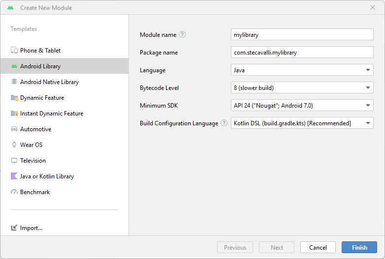
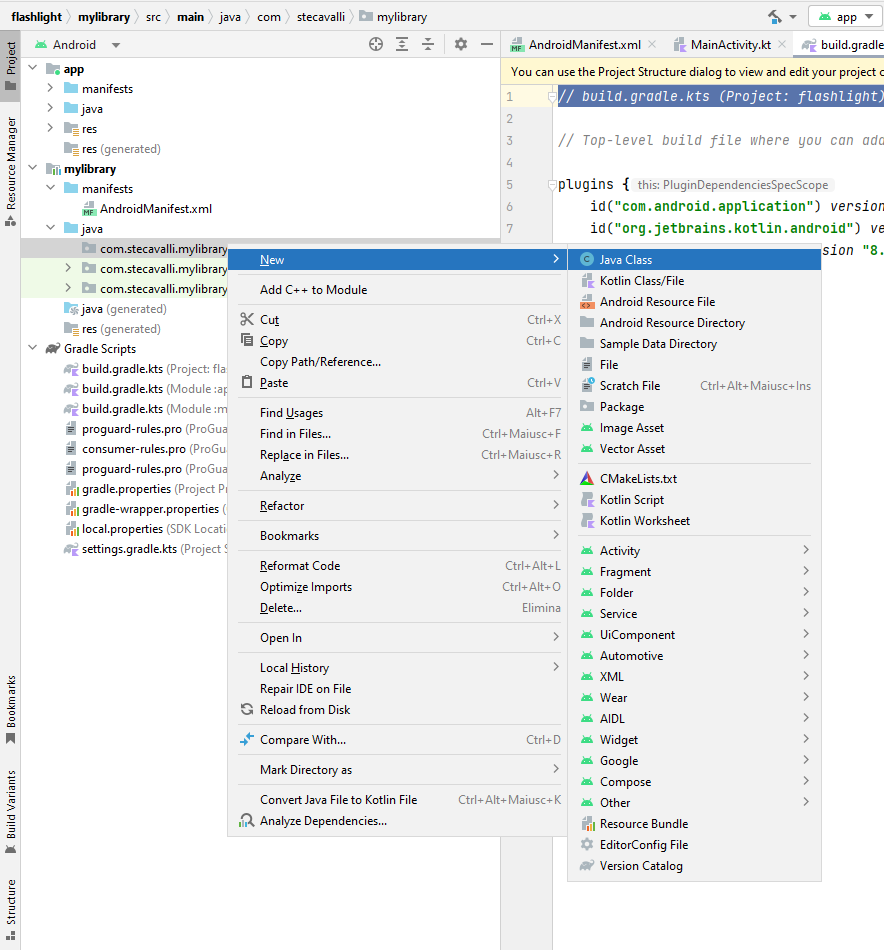
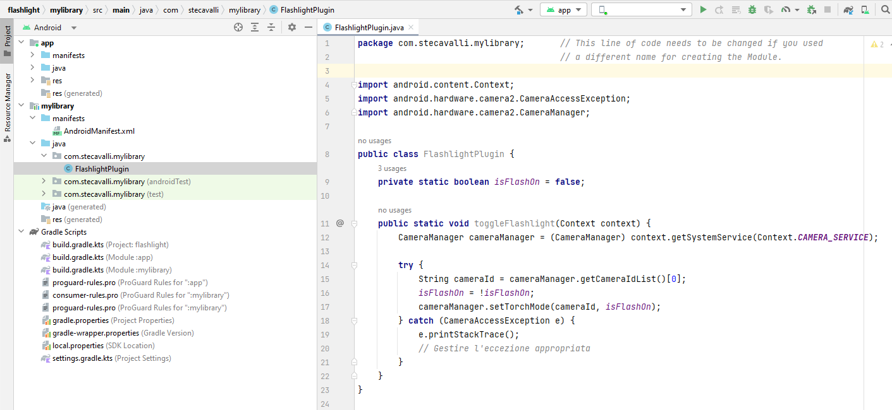
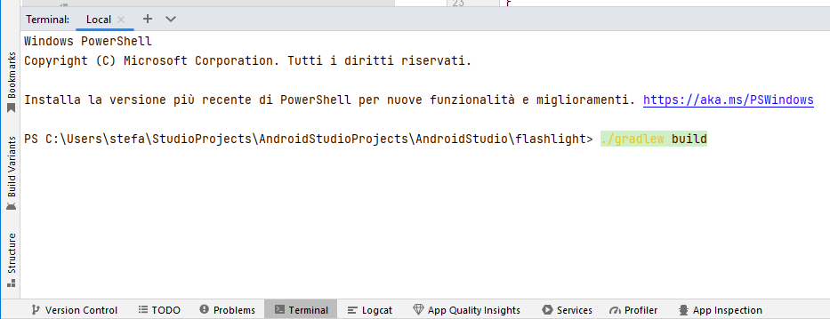
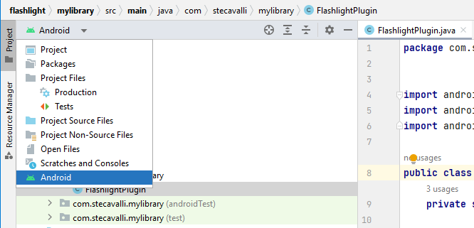
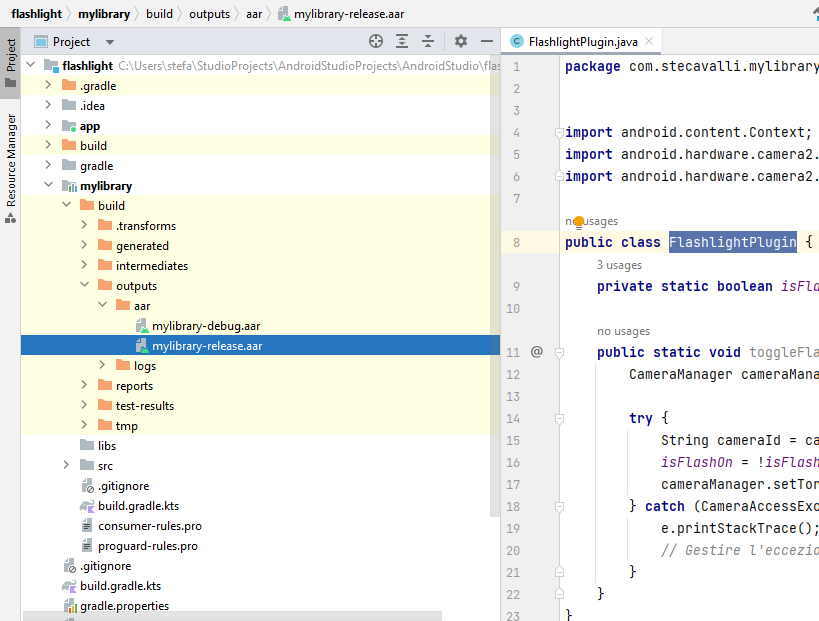

# Plugin-for-Unity
How to create a plugin, for use in Unity, in Android Studio using the Java language.
 
This repository refers to the [Flashlight-Android](https://github.com/stecavalli/Flashlight-Android) repository found in my GitHub.
# Software used:
Android Studio Giraffe | 2022.3.1 Patch 3
 
Unity 2022.3.15f1
# Guide to creating and developing the app
Follow the directions to create the application in Android Studio that are given in the repository [Flashlight-Android](https://github.com/stecavalli/Flashlight-Android).
  
  
In order to create the Plugin you must first create a new module, follow the instructions below:
  
Click on File --> New --> New Module, a window like the following will open:
  
  

  
  
Select Android Library in the Templates and then choose the name your Plugin will have by modifying the Module Name field. Select Java as the language and then click Finish. When the Module has been created it will be necessary to create a new Java class by clicking with the right mouse button, as seen in the following image, and selecting New --> Java Class. Choose the name of the Java file, which in my case is <b>FlashlightPlugin.java</b>.
  
  

  
  
After creating the FlashlightPlugin.java file, copy and paste the code from the FlashlightPlugin.java file found in this repository. You will get something like this:
  
  

  
  
Open terminal and type <b>./gradlew build</b>. 
  
  

  
  
The file mylibrary-release.aar will be created and you can find it in the build directory of the mylibrary Module. 
  
Select Project at the top left by clicking on the Android icon and label:
  
  

  
  
The mylibrary-release.aar file is located in the flashlight --> mylibrary --> outputs --> aar directory. See the following image:
  
  

  
  
