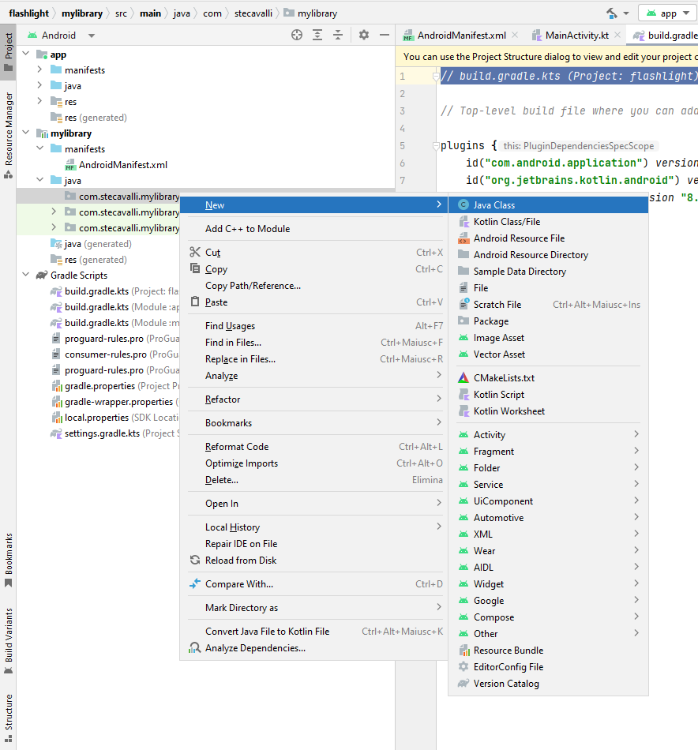

# Plugin-for-Unity
How to create a plugin in Java for use in Unity. This repository refers to the [Flashlight-Android](https://github.com/stecavalli/Flashlight-Android) repository found in my GitHub.
# Software used:
Android Studio Giraffe | 2022.3.1 Patch 3
Unity 2022.3.15f1
# Guide to creating and developing the app
Follow the directions to create the application in Android Studio that are given in the repository [Flashlight-Android](https://github.com/stecavalli/Flashlight-Android).
  
  
In order to create the Plugin you must first create a new module, which in my case I called mylibrary and which you can see in the following image:
  
  

  
  
To create the Module follow the instructions below:
Click on File --> New --> New Module, a window like the following will open:
  
  

  
  
Select Android Library in the Templates and then choose the name your Plugin will have by modifying the Module Name field. Select Java as the language and then click Finish. When the Module has been created it will be necessary to create a new Java class by clicking with the right mouse button, as seen in the following image, and selecting New --> Java Class. Choose the name of the Java file, which in my case is <b>FlashlightPlugin.java</b>.
  
  

  
  
